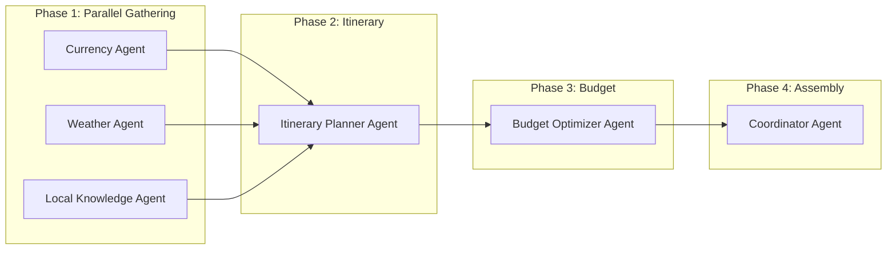
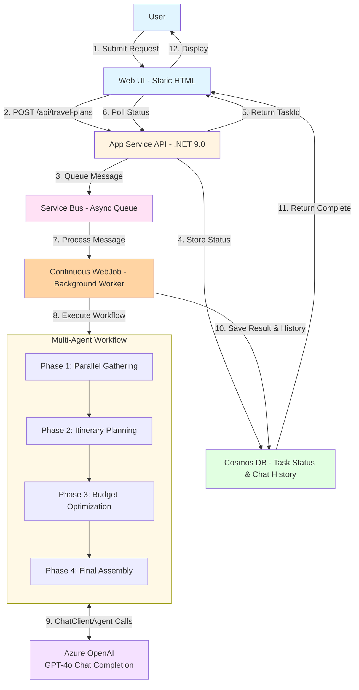
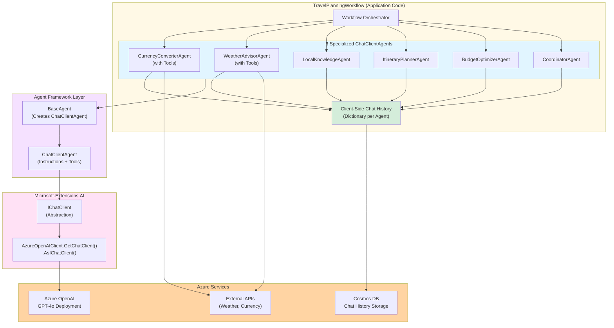

# Travel Planner Architecture

## Multi-Agent Workflow Overview

This application demonstrates a **client-side multi-agent system** where specialized AI agents collaborate to create comprehensive travel plans. The workflow orchestrates 6 specialized agents across 4 phases using **ChatClientAgent** for full control over agent lifecycle and chat history management.

### Specialized Agents

1. **Currency Converter Agent** - Real-time exchange rates (Frankfurter API)
2. **Weather Advisor Agent** - Weather forecasts and packing tips (NWS API)
3. **Local Knowledge Agent** - Cultural insights and local customs
4. **Itinerary Planner Agent** - Day-by-day activity scheduling
5. **Budget Optimizer Agent** - Cost allocation and optimization
6. **Coordinator Agent** - Final assembly and formatting

### Workflow Execution

**Phase 1 (10-40%)**: Parallel information gathering
- Currency, Weather, and Local agents run simultaneously
- External API calls for real-time data
- Results stored in workflow state

**Phase 2 (40-70%)**: Itinerary creation
- Uses context from Phase 1 (weather, local knowledge)
- Creates detailed daily activities and dining

**Phase 3 (70-90%)**: Budget optimization
- Analyzes itinerary costs
- Allocates budget across categories

**Phase 4 (90-100%)**: Final assembly
- Coordinator compiles all agent outputs
- Formats comprehensive travel plan

## High-Level System Overview

## How It Works

### ChatClientAgent Architecture

This diagram shows how ChatClientAgent wraps IChatClient for client-side agent execution:

**Key Components:**

1. **TravelPlanningWorkflow**: Application orchestrator that coordinates agent execution
2. **ChatClientAgent**: Agent Framework wrapper adding instructions and tools to IChatClient
3. **IChatClient**: Microsoft.Extensions.AI abstraction for chat completion
4. **Client-Side Chat History**: Dictionary storing conversation per agent in memory, then Cosmos DB
5. **AIFunctionFactory**: Converts C# methods to tools for function calling
6. **Azure OpenAI**: Direct chat completion API calls (no Foundry agent resources)

### 1. **User Submits Travel Request**
User fills out form with destination, dates, budget, interests, and preferences.

### 2. **API Creates Async Task**
- API creates task in Cosmos DB with status "queued"
- Sends message to Service Bus queue
- Returns taskId immediately (non-blocking)

### 3. **Background Processing**
- Continuous WebJob picks up message from queue
- Updates task status to "processing"
- Calls Azure AI Foundry to generate itinerary

### 4. **AI Multi-Agent Generation**
- WebJob executes TravelPlanningWorkflow orchestrator
- Workflow creates and manages 6 specialized ChatClientAgent instances
- **Phase 1**: Currency, Weather, Local Knowledge agents run in parallel
- **Phase 2**: Itinerary Planner agent creates daily schedule
- **Phase 3**: Budget Optimizer agent allocates funds
- **Phase 4**: Coordinator agent assembles final plan
- Each agent wraps IChatClient with custom instructions and tools
- Chat history managed client-side and stored in Cosmos DB per agent
- Agents use GPT-4o via direct Azure OpenAI API calls
- External APIs provide real-time data (weather, currency) via AIFunctionFactory tools

### 5. **Store and Return Results**
- Parses AI response and extracts travel tips
- Updates Cosmos DB with completed itinerary
- Task status changes to "completed"

### 6. **UI Polling and Display**
- UI polls API every second for status updates
- Shows progress bar during processing
- Displays formatted itinerary when complete

## Key Architecture Patterns

### ✅ Async Request-Reply Pattern
- API returns immediately with taskId
- Client polls for status updates
- No long-running HTTP connections

### ✅ Background Processing with WebJobs
- Continuous WebJob runs as separate process on App Service
- Service Bus decouples API from heavy AI work
- Enables independent restarts and monitoring
- Retry logic for reliability

### ✅ Azure AI Agent Framework (Client-Side)
- **ChatClientAgent**: Wraps IChatClient with instructions and tools
- **Client-Side Orchestration**: Application code controls workflow coordination
- **Flexible Chat History**: Stored in Cosmos DB per agent, fully managed by application
- **Parallel Execution**: Independent agents run simultaneously
- **Tool Integration**: AIFunctionFactory creates tools from C# functions
- **External API Integration**: Weather and currency APIs via function calling
- **No Server Resources**: Agents are C# objects, no persistent Foundry resources created

### ✅ Managed Identity
- No credentials in code
- Secure authentication to all Azure services

### ✅ State Management
- Cosmos DB stores all task state
- 24-hour TTL for automatic cleanup

## Key Features

### WebJob Architecture
- **Separate Process**: WebJob runs independently from the API
- **Independent Restart**: Restart WebJob without affecting API
- **Dedicated Logging**: WebJob logs separate from API logs in Azure Portal
- **Single Instance**: WEBJOBS_RUN_ONCE prevents duplicate message processing
- **Continuous Execution**: Always-on WebJob for immediate message processing

### Asynchronous Processing
- **Request-Reply Pattern**: Client submits request → receives taskId → polls for status
- **Background Processing**: Service Bus ensures reliable async execution
- **Progress Tracking**: Real-time status updates (queued → processing → completed)

### Azure AI Agent Framework
- **ChatClientAgent**: Client-side agents wrapping IChatClient
- **Custom Orchestration**: Application-controlled workflow coordination
- **Tool Calling**: AIFunctionFactory for external API integration
- **Chat History**: Client-side management stored in Cosmos DB
- **Direct LLM Calls**: Azure OpenAI GPT-4o via IChatClient

### State Management
- **Cosmos DB**: Centralized state storage with TTL for auto-cleanup
- **Task Status**: Tracks progress and stores results
- **Chat History**: Per-agent conversation storage for context
- **24-Hour TTL**: Automatic cleanup of old travel plans and chat histories

### Scalability
- **Premium App Service**: P0v4 Windows tier for production workloads
- **Service Bus**: Decouples API from processing for horizontal scaling
- **Managed Identity**: Secure, credential-less authentication
- **WebJob Worker**: Dedicated process for heavy AI processing

### Reliability
- **Retry Logic**: Service Bus max 3 delivery attempts
- **Dead Letter Queue**: Failed messages moved to DLQ after max retries
- **Error Handling**: Comprehensive try-catch with logging
- **Status Tracking**: Detailed progress and error messages
- **Duplicate Prevention**: WebJob checks if task already completed before reprocessing
- **Cleanup**: Automatic 24-hour document expiration in Cosmos DB
