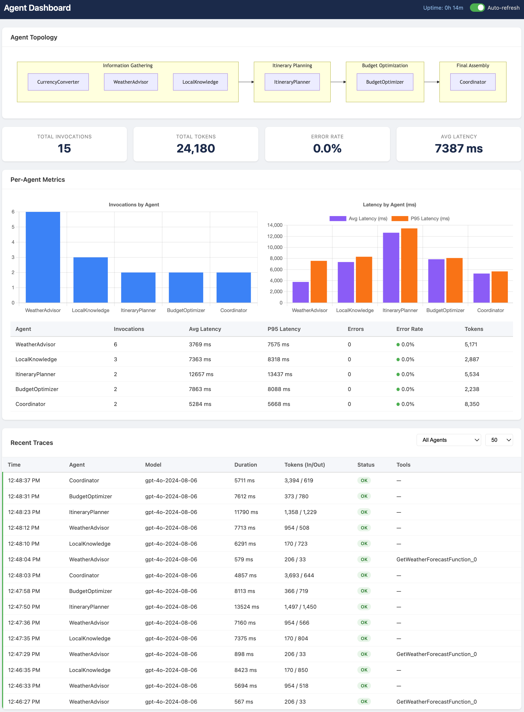

# Azure.AppService.AgentDashboard

A lightweight observability dashboard for .NET AI agent applications running on Azure App Service. Drop it into any app that uses `IChatClient` from [Microsoft.Extensions.AI](https://www.nuget.org/packages/Microsoft.Extensions.AI) and get real-time visibility into agent performance — no external services required.



## Why this exists

Multi-agent applications are hard to observe. When you have several agents calling an LLM — potentially in parallel, across phases, or even across processes (e.g., an API + a WebJob) — it's difficult to answer basic questions:

- **Which agent is slow?** Average and P95 latency per agent, at a glance.
- **How many tokens am I burning?** Per-agent token counts (input/output) to understand cost.
- **Is anything failing?** Error rates and error messages, per agent.
- **What's the execution flow?** A topology diagram showing how agents are organized into phases.
- **What just happened?** A chronological trace of every LLM call with model, duration, tokens, tools used, and status.

This package answers all of these with **zero external dependencies** — no Application Insights, no OpenTelemetry collector, no database. Everything runs in-memory (with optional file-based persistence for cross-process scenarios), and the dashboard is served as an embedded HTML page from the package itself.

## Features

- **IChatClient middleware** — Wraps your `IChatClient` via the standard `DelegatingChatClient` pattern. Every `GetResponseAsync` and `GetStreamingResponseAsync` call is automatically instrumented.
- **Per-agent metrics** — Invocation count, average/P50/P95/P99 latency, error count, error rate, and token usage (input/output/total) per agent.
- **Trace log** — Chronological list of every LLM call with timestamp, agent name, model ID, duration, token counts, status, tools used, and error details.
- **Agent registry** — Pre-register your agents with names and descriptions, or let the dashboard auto-discover them from live traffic.
- **Topology visualization** — Define the phases of your multi-agent workflow and see a Mermaid-rendered directed graph.
- **Embedded HTML dashboard** — A single-page dashboard served from an embedded resource. No static files to deploy.
- **JSON API endpoints** — All data is available as JSON for custom integrations.
- **Cross-process telemetry** — Optional shared file persistence (JSONL) for scenarios where agents run in a different process than the dashboard (e.g., App Service + WebJob).
- **Auto-refresh** — Dashboard polls every 5 seconds with a toggle to pause.

## Requirements

- .NET 9.0 or later
- ASP.NET Core (for serving the dashboard UI)
- [Microsoft.Extensions.AI](https://www.nuget.org/packages/Microsoft.Extensions.AI) 10.3.0 or later
- Your application must use `IChatClient` for LLM calls

## Installation

This package is distributed as source via GitHub. There are three ways to consume it:

**Project reference** (simplest) — clone the repo and reference the project directly:

```xml
<ProjectReference Include="path/to/src/Azure.AppService.AgentDashboard/Azure.AppService.AgentDashboard.csproj" />
```

**Local NuGet package** — build a `.nupkg` and consume it from a local feed:

```shell
dotnet pack src/Azure.AppService.AgentDashboard -c Release -o ./nupkgs
dotnet nuget add source ./nupkgs --name local
dotnet add package Azure.AppService.AgentDashboard --source local
```

**Copy the source** — the package is self-contained in `src/Azure.AppService.AgentDashboard/` with a single external dependency (`Microsoft.Extensions.AI`). Copy the folder into your solution and add a project reference.

## Quick start

Three lines of code:

```csharp
using Azure.AppService.AgentDashboard.Extensions;

var builder = WebApplication.CreateBuilder(args);

// 1. Register the dashboard services
builder.Services.AddAgentDashboard();

// 2. Register your IChatClient with the dashboard middleware
builder.Services.AddChatClient(services =>
{
    // ... create your IChatClient (e.g., Azure OpenAI)
    return client.GetChatClient("gpt-4o").AsIChatClient();
}).UseAgentDashboard();

var app = builder.Build();

// 3. Map the dashboard endpoints
app.MapAgentDashboard();

app.Run();
```

Navigate to `/agents/dashboard` to see the UI.

## Tagging agents

By default, all LLM calls are attributed to a "default" agent. To see per-agent breakdowns, tag your `ChatOptions` with `.WithAgentName()`:

```csharp
using Azure.AppService.AgentDashboard.Extensions;

var options = new ChatOptions { Instructions = "You are a helpful assistant." }
    .WithAgentName("MyAgent");

var response = await chatClient.GetResponseAsync(messages, options);
```

The middleware reads `AgentName` from `ChatOptions.AdditionalProperties` to attribute the call. If your agent framework passes `ChatOptions` to the underlying `IChatClient` (e.g., via `ChatClientAgent` in the Microsoft Agent Framework), set the agent name on those options.

## Registering agents and topology

For richer dashboard output, pre-register your agents and define how they connect:

```csharp
using Azure.AppService.AgentDashboard.Extensions;
using Azure.AppService.AgentDashboard.Models;

builder.Services.AddAgentDashboard(options =>
{
    // Register known agents
    options.RegisteredAgents =
    [
        new AgentRegistration { Name = "Coordinator", Description = "Orchestrates the workflow", AgentType = "CoordinatorAgent" },
        new AgentRegistration { Name = "Researcher", Description = "Gathers information", AgentType = "ResearchAgent" },
        new AgentRegistration { Name = "Writer", Description = "Produces final output", AgentType = "WriterAgent" },
    ];

    // Define the execution flow
    options.Topology = new AgentTopology
    {
        Phases =
        [
            new TopologyPhase { Name = "Research", Agents = ["Researcher"], NextPhases = ["Writing"] },
            new TopologyPhase { Name = "Writing", Agents = ["Writer"], NextPhases = ["Review"] },
            new TopologyPhase { Name = "Review", Agents = ["Coordinator"] },
        ]
    };
});
```

If you don't register agents, the dashboard will auto-discover them from live traffic and display a flat topology.

## Cross-process telemetry

If your agents run in a separate process from the dashboard (e.g., agents in a WebJob, dashboard served from the API), use `SharedFilePath` to share telemetry via the filesystem:

```csharp
// In BOTH the API and WebJob:
var telemetryDir = Path.Combine(
    Environment.GetEnvironmentVariable("HOME") ?? Path.GetTempPath(),
    "LogFiles");

builder.Services.AddAgentDashboard(options =>
{
    options.SharedFilePath = Path.Combine(telemetryDir, "agent-telemetry.jsonl");
    // ... other options
});
```

On Azure App Service, both the main site and WebJobs share the `%HOME%` filesystem, so telemetry written by the WebJob is immediately visible in the API's dashboard. Events are stored in JSONL format with incremental reads and ID-based deduplication.

## Configuration options

| Option | Default | Description |
|---|---|---|
| `RoutePrefix` | `"/agents"` | URL prefix for all dashboard endpoints |
| `MaxStoredEvents` | `1000` | Maximum number of telemetry events kept in memory |
| `RegisteredAgents` | `[]` | Pre-registered agent definitions for the registry |
| `Topology` | `null` | Agent workflow topology for the visualization |
| `SharedFilePath` | `null` | File path for cross-process JSONL telemetry persistence |

## API endpoints

All endpoints are under the configured `RoutePrefix` (default: `/agents`):

| Endpoint | Description |
|---|---|
| `GET /agents/dashboard` | Embedded HTML dashboard UI |
| `GET /agents/api/registry` | List of all registered and discovered agents |
| `GET /agents/api/metrics` | Aggregate and per-agent metrics (invocations, latency, tokens, errors) |
| `GET /agents/api/traces?limit=50&agent=MyAgent` | Recent invocation events, optionally filtered by agent |
| `GET /agents/api/topology` | Agent topology graph (configured or auto-generated) |

## What gets captured

Every `IChatClient.GetResponseAsync` and `GetStreamingResponseAsync` call records:

| Field | Description |
|---|---|
| `agentName` | Resolved from `ChatOptions.AdditionalProperties["AgentName"]` or the default |
| `timestamp` | UTC timestamp of the call |
| `duration` | Wall-clock duration of the LLM call |
| `success` | Whether the call completed without exceptions |
| `errorMessage` | Exception message (if failed) |
| `modelId` | Model identifier from the response or options |
| `inputTokens` | Input token count from `ChatResponse.Usage` |
| `outputTokens` | Output token count from `ChatResponse.Usage` |
| `totalTokens` | Total token count from `ChatResponse.Usage` |
| `messageCount` | Number of messages in the request |
| `toolsUsed` | List of tool/function names invoked during the call |

## Architecture

```
┌─────────────────────────────────────────────────────────────────────────────────────────────────┐
│                  Your Application                                                               │
│                                                                                                 │
│  Agent A ──┐                                                                                    │
│  Agent B ──┤── IChatClient ── InstrumentingChatClient ── Inner IChatClient (e.g., Azure OpenAI) │
│  Agent C ──┘        │                                                                           │
│                     │                                                                           │
│              AgentTelemetryStore                                                                │
│                 │           │                                                                   │
│           In-Memory    JSONL File (optional)                                                    │
│              Queue      (shared across                                                          │
│                         processes)                                                              │
│                     │                                                                           │
│         AgentDashboardEndpoints                                                                 │
│           /agents/dashboard                                                                     │
│           /agents/api/*                                                                         │
└─────────────────────────────────────────────────────────────────────────────────────────────────┘
```

The `InstrumentingChatClient` is a `DelegatingChatClient` that wraps your real `IChatClient`. It measures every call, records the result to `AgentTelemetryStore`, and passes through to the inner client transparently. The store holds events in a bounded `ConcurrentQueue` and optionally syncs to/from a JSONL file for cross-process visibility.

## Limitations

- **In-memory storage** — Telemetry is lost on application restart (unless `SharedFilePath` is configured, in which case it persists across restarts up to `MaxStoredEvents`).
- **Single-node only** — The in-memory store and file-based persistence are designed for single App Service instances. For multi-instance scenarios, consider using a shared storage backend.
- **No authentication** — The dashboard endpoints are publicly accessible. In production, protect them with authentication middleware or network restrictions.
- **Token counts depend on the model provider** — `Usage` data availability varies by LLM provider and SDK version. If your provider doesn't return usage info, token fields will be null.

## License

MIT
